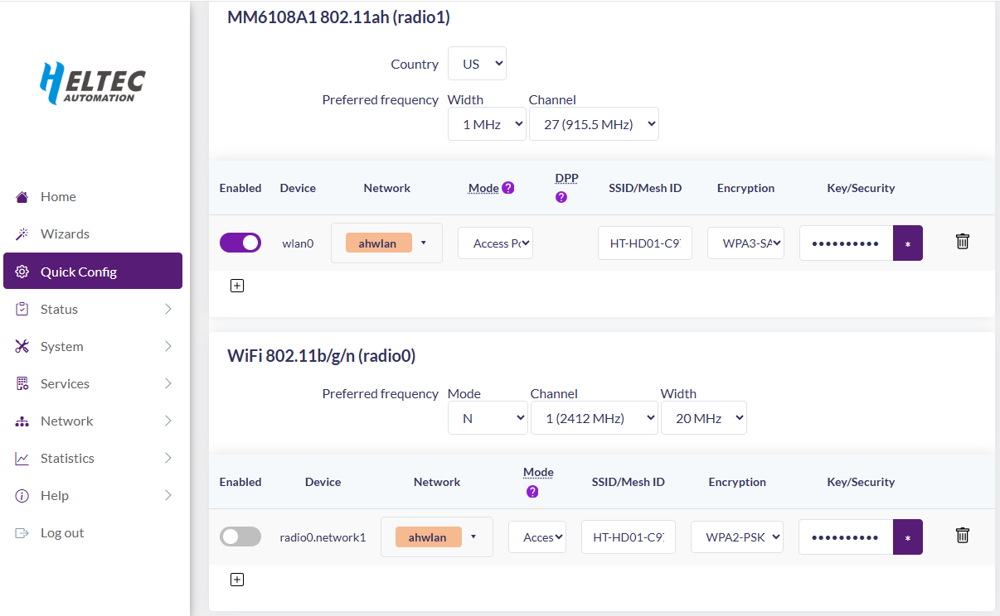

# Real-World Comparison of Z-Wave Long Range, LoRa, Wi-Fi HaLow Sub-GigaHertz Wireless Technologies

This repo contains the scripts and data captured as part of the Z-Wave Alliance White Paper Comparison of ZWLR/LoRa/Wi-Fi HaLow during the summer of 2026.

The purpose of this repo is to enable others to replicate the results.
This project captured actual real-world data of the RF Range of each Sub-GHz protocol. 

# Status

- ZWLR working
- LoRa - Working but sends every 10 seconds without a request so only 1-way comms
- Wi-Fi HaLow - Working
- Paper
    - Basic outline completed
    - Paper will be available behind the ZWA website but available to all with an email
    - Presentations at The Things Conference and Z-Wave Alliance Summit 2026 will be available on the ZWA members portal

# Setup

- **Z-Wave Equipment**
    - [Home Assistant ZWA-2](https://www.home-assistant.io/connect/zwa-2/) Z-Wave Controller
    - [ZRADmini](https://github.com/drzwave/ZRAD) End Device with [Geographic Location](https://github.com/drzwave/GeographicLocationCC) Command Class support
        - SMA Antenna [TI.92.2113](https://www.digikey.com/en/products/detail/taoglas-limited/TI-92-2113/11197416)
    - [SAM-M8Q](https://www.sparkfun.com/sparkfun-gps-breakout-chip-antenna-sam-m8q-qwiic.html) GPS receiver for the ZRADmini
        - SAM-M8Q is connected to the ZRADmini via QWIIC connector and placed in a 3D printed enclosure
    - Powered from either 3AAA batteries or a USB-C power bank
        - Since ZRADmini draws so little power many USB-C power banks will turn off thus 3AAA is more reliable

- **LoRa Equipment**
    - Two [WIO Tracker L1 Pro](https://www.seeedstudio.com/Wio-Tracker-L1-Pro-p-6454.html)
    - These come with 3D printed enclosures, OLED display, SMA Antenna and battery

- **Wi-Fi HaLow Equipment**
    - Heltec [HT-HD01](https://heltec.org/project/ht-hd01/) Wi-Fi Halow Dongle Network Bridge
        - Includes both a Station and Client dongles
    - Raspberry Pi for running python to capture the SAM-M8Q GPS coordinates
    - SAM-M8Q GPS receiver in UART mode connected to the RPi header:
        - Recommend soldering a header with a 10 pin ribbon cable to the SAM-M8Q that plugs directly into the RPi
        - 3.3v -> Pin 1
        - GND -> Pins 9 & 6
        - Tx -> Pin 10 (Rx on RPi)
        - Rx -> Pin 8 (Tx on RPi)
    - TP-Link [TL-WR1502X](https://www.tp-link.com/us/home-networking/wifi-router/tl-wr1502x/) Travel Router
        - Connect the HD01 Station unit to the ethernet port
        - The router can power HD01 from the USB port
    - Connect the PC to the TP-Link local WiFi network usually 192.168.0.x
        - Wait for the HD01 nodes to connect (the LED is solid blue)
        - Browse to 192.168.0.1 and login
        - Check that the network is setup and note the IP address of the RPi

## Z-Wave Setup

- Flash the ZRADmini with a bootloader and the file ZWLR/SwOnOff_GeoLoc.s37
    - This is a binary switch with Geographic Location CC via the SAM-M8Q
    - Extract the QR code from the device
- Connect the ZWA-2 to a PC
    - Using the PC Controller (PCC) application, scan the QR code from the ZRADmini and include it with Z-Wave Long Range
- Confirm that the ZRADmini LED turns on/off with a Basic On/Off and sending a GeoLoc GET replies with a GeoLoc REPORT
    - Confirm the ZRADmin is connected securely and with ZWLR
    - Close the PCC

## LoRa Meshtastic Setup

I was unable to request Position from the far node and receive it more than once every 3 minutes.
Three minutes per reading would take far too long to collect any meaningful data. 
Appears this is a meshtastic limitation to avoid excessive radio traffic on the mesh.
The solution is to use the built-in position broadcast mechanisim in Meshtastic to simply send the position every ~10 seconds.
Since this is proving only 1-way communication, the usable RF range for LoRa for 2-way communication is somewhat less than shown in the data.

- Download the Meshtastic App for windows
-	Connect via either USB or BLE – both units are setup the same except as noted
-	Settings-> Radio Config -> LoRa
    -	Region = US
    -	Modem Preset = Short Turbo – this is the fastest rate = 27kbits
-	Settings-> Radio Config -> Channels
    -	Name = drzwave
    -	Pre-shared 8-bit key = “AA==” - The default is AQ== so anything else makes it a private encrypted channel
    -	Location = Precise (only required for the battery powered node)
-	Settings-> Radio Config -> Security
    -	Copy the public key from the USB node and paste it into the Primary Admin Key for the battery node
    -	22b5 Pub Key = Om7L2+/X2T3TIb8ZFTBpM8FYjs8mwWZb4rN1jeyOp2s=
-	Settings-> Device Config -> Device
    -	Role = client mute (does not repeat other messages – we only want point-to-point)
-	Settings-> Device Config -> Position (battery node only)
    -	Turn off (gray) “enable Smart Position”
    -	Broadcast Interval = 10 (send Postion data every 10 seconds)
    -	GPS Update Interval = 4 (pull GPS coordinates from the on-board GPS chip every 4 seconds)
-	Click on Save – Device will normally reboot – close and reopen meshtastic
    -	Must restart meshtastic after reboot or when it hangs which is often
-	Configure the other node

## Wi-Fi HaLow Setup

- Plug in the TPLink Router
- Plug the Station dongle into the ethernet port of the TPLink
- Plug a USB-C cable from TPLink to Station dongle to power it
- Plug the RPi into a large battery bank
- Plug the Client dongle into the Ethernet port of the RPi
- Plug the Client dongle USB into the battery bank
    - NOTE! do NOT plug it into the RPi USB ports as it does NOT have enough power and will cause the RPi to be flakey
- Connect the TPLink to your local router on your local network to login and configure it
- Identify the TPLink IP address and browse to it
    - login as root with the password given with the unit
    - Configure it as Router and provide details for it to connect to your local Wifi
    - It should now be able to connect to your Wifi and then run NAT to other downstream devices like the dongles and RPi and your PC
- Browse to each dongle and login (root - heltec.org)
    - Click on Quick Config and setup as shown here:
    - Disable Radio0 (2.4GHz)
    - Country = US (or your region)
    - Freq Width = 1MHz (the slowest, longest range 3.5mbps)
    - Freq Channel = 27 (or any channel)

# Running an RF Range Test

- Mount the remote equipment on an eBike. See photo.
- Place the controller devices typically on the roof of a car, ideally 1' above the roof on a non-conductive surface
- Connect the PC to the TpLink router via its local wifi
    - browse to 192.168.0.1 and login
        - view the network and wait for the HaLow nodes to join
- At the stationary location, on a windows PC, open 3 separate shell windows
- One window for each protocol
- Halow 
    - ssh into the RPi (its IP address is shown when browsing the TpLink)
    - cd ZwlrLora/HaLow
    - ./startGPSServer.sh
    - Starts the server with a TCP port to return GPS data over WiFi HaLow
    - exit - closes the SSH session but the server keeps running due to nohup
    - python GetHaLowGPS.py
    - Should start getting GPS data
- LoRa
    - python meshtastic_position_listener.py --port COM7
- ZWLR
    - Start the capture: node ZWJSRangeTest.js COMx
    - The ZWLR node with a GPS receiver should beep each time it sends a GeoLoc report letting the person know when they are beyond range
- Take the remote units for a ride!
    - Start at the controller location
        - The mapping scripts assume the first point is at the controller
        - Often the first few data points need to be deleted from the file to get the proper reading for the first point. This is especially common for LoRa which seems to take several minutes for the GPS to settle. Ocassionally LoRa has invalid data points as well which must be deleted.
    - Best practice is to circle outward at about 10mph
    - Once ZWLR is unable to beep, then return to the start, ctl-C the scripts
    - Rename the .csv files with meaningful names - YYMMDDProtocolLocationDetails.csv
- Several scripts will read the .csv file(s) and plot them on a map
    - mapGPS.py will map one .CSV file
    - mapGPSTri.py will read all 3 .CSV files and plot them all on the same map in different colors
    - mapGPSAnimated.py will create an animated .GIF of the map showing the direction of travel
    - See the comments in each file for more details

# Folder Description

- ZWLR - Z-Wave Long Range scripts and data
- LoRa - LoRaWAN scripts and data
- HaLow - Wi-Fi HaLow scripts and data
- Data - Contains the captured data from various locations
    - map images are not saved as they can be generated from the .csv files
- pix - Images

# Sponsor

- The [Z-Wave Alliance](https://z-wavealliance.org) provided some funding to offset the equipment cost and partial compensation to prioritize this effort. Much of the effort was donated by Eric Ryherd who is a Z-Wave enthusiast and long-time developer. However, ALL scripts, equipment and data are provided in this repo to enable others to replicate the results. Please contact Eric with comments, improvements, mistakes, and data from your own efforts. Please do NOT comment without actual data to back up your assertions.
